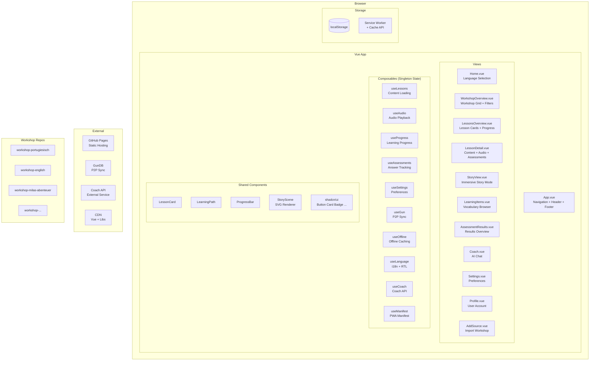
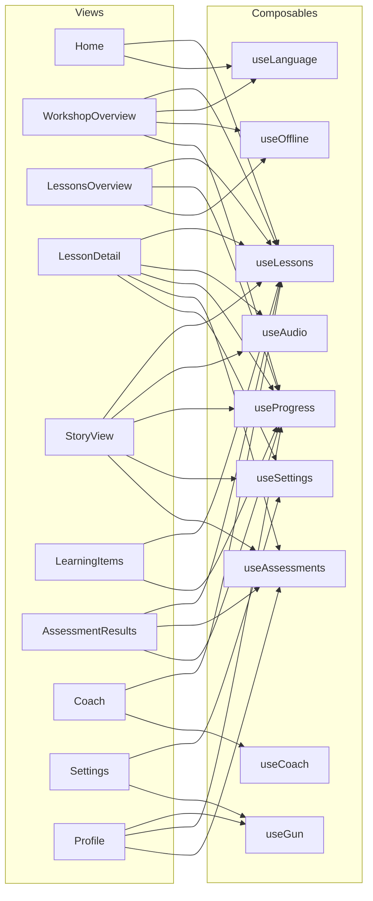
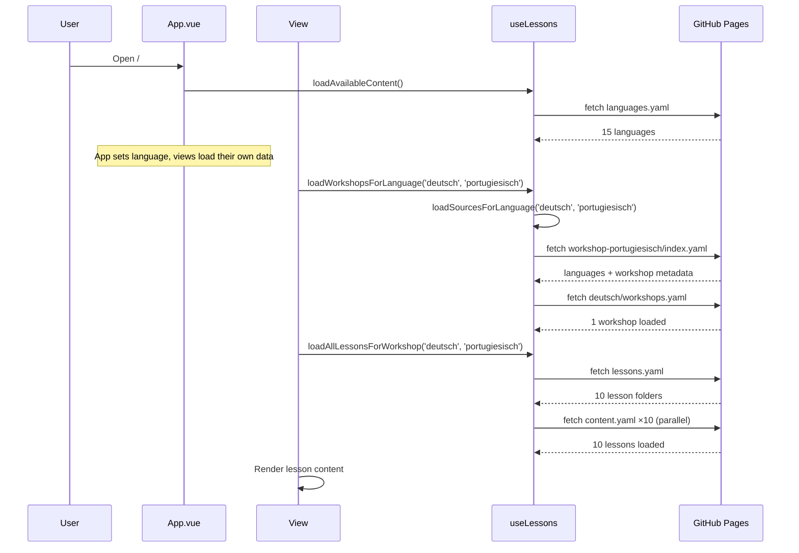
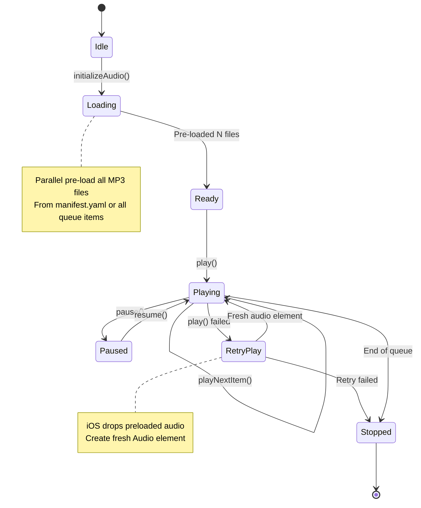
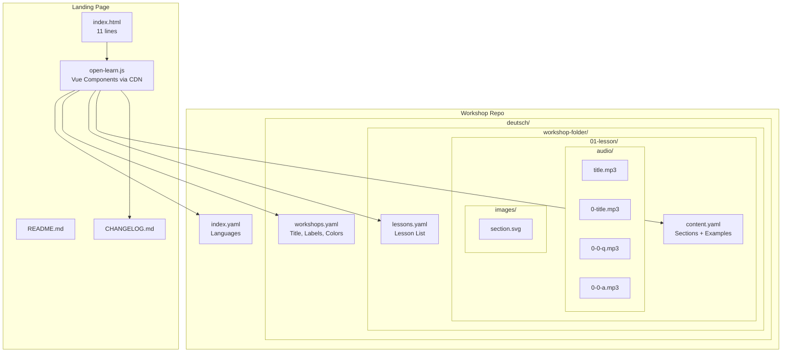
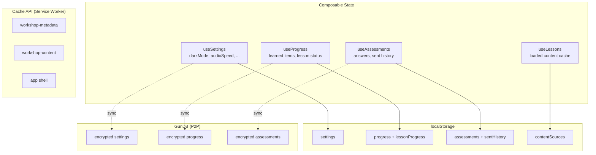
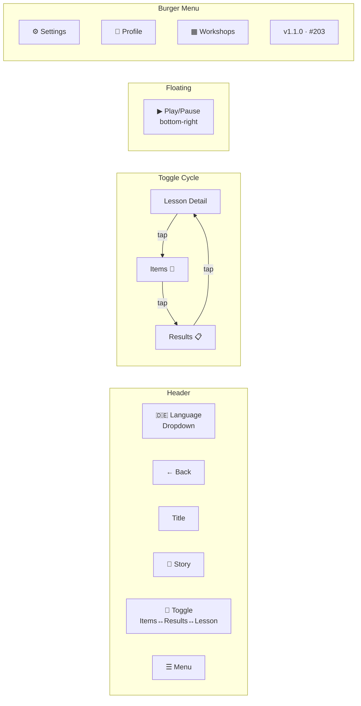

# Open Learn Architecture

## System Overview

## View → Composable Dependencies

## Data Loading Flow

## Audio Playback Flow

## Workshop Content Structure

## State Persistence

## Navigation (Mobile)

